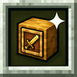
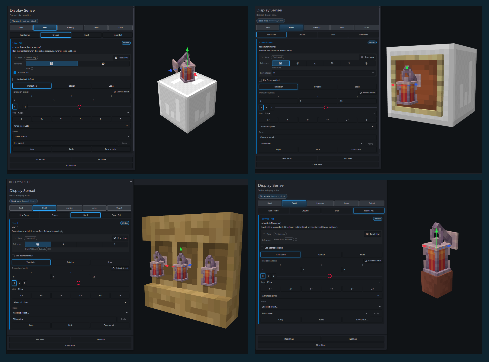
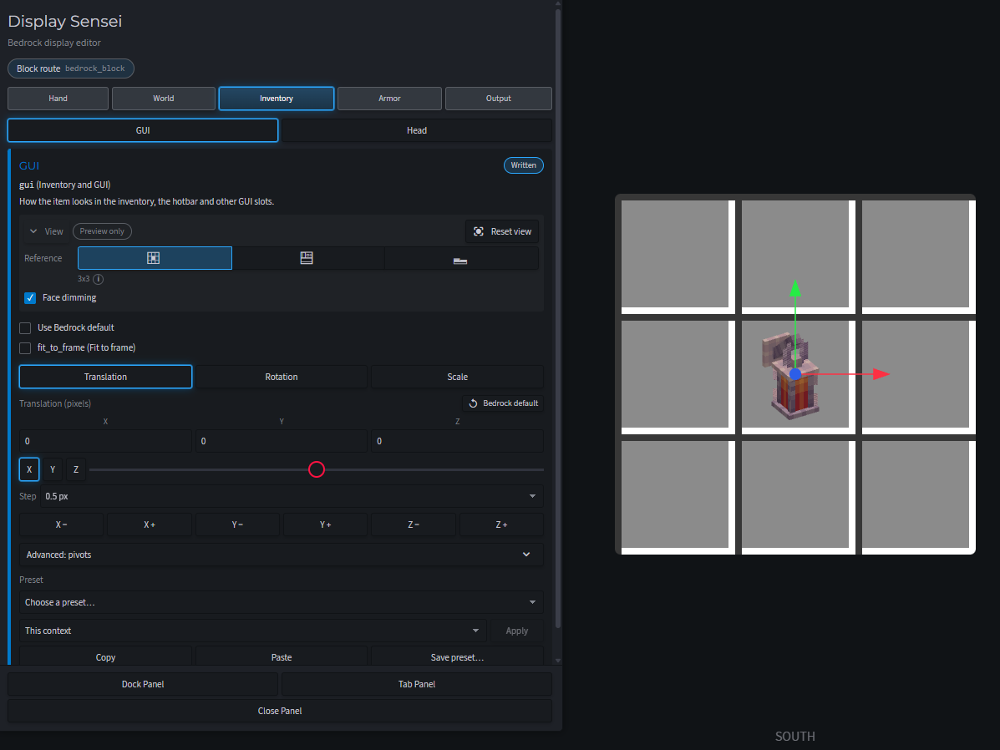
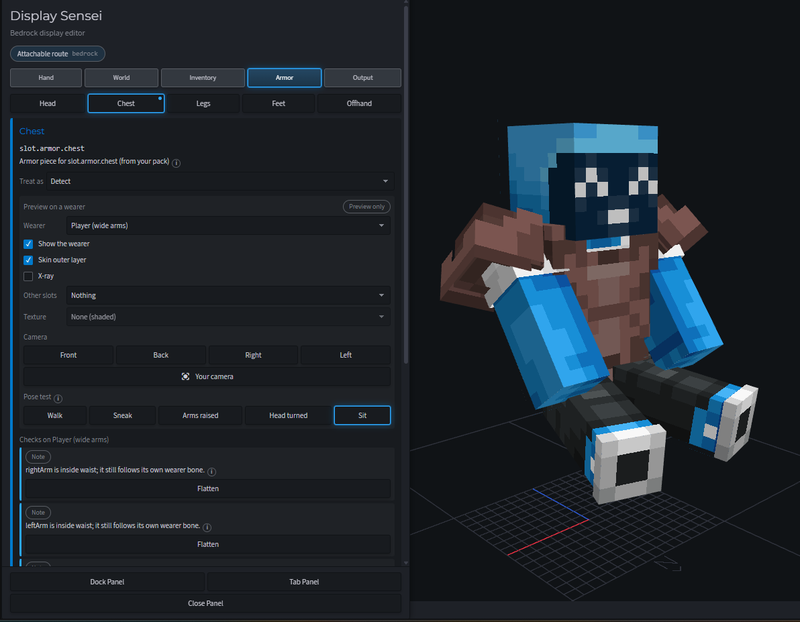
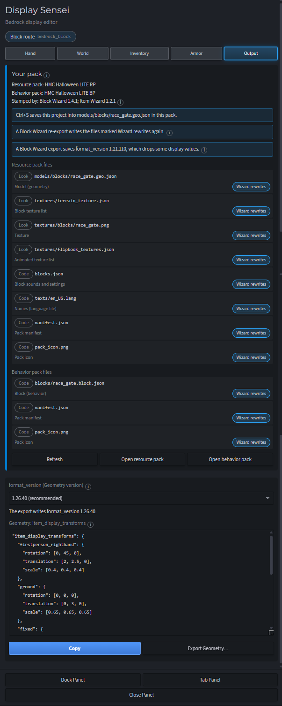

# Display Sensei

A Blockbench plugin for Minecraft: Bedrock Edition. It lets you set up how your Bedrock models look in game.

**Blocks:** held in first and third person, in item frames, on the ground, on shelves, in flower pots, in the inventory and on your head.

**3D items (attachables):** how they sit in your main hand and off hand, first and third person. It can write the hold straight into your pack's hold animation file.

**Armor:** see it on players, armor stands and mobs. It checks the fit, can fix bone names and pivots, and lets you test it in different poses.

**Your pack:** shows the pack files that go with the model you have open, whether you used Blockbench's Item, Block and Entity Wizards or made the pack by hand.

Blockbench's Display mode only covers block models on Bedrock, so this shows everything on Bedrock models and poses instead. It can also match first person to third person so they line up.

Writing into your pack and the Your pack card need the desktop app.

## Usage

Open a Bedrock Block or Bedrock Entity project, then choose **Tools > Display Sensei**. The panel has five tabs.

### Hand

How the model sits in the right and the left hand, in 1st Person, 3rd Back and 3rd Front. For a block it sets the hand transforms; for a 3D item it edits the hold animations of its attachable. Match to 3rd person sets first person from the third-person hold, and presets start from common holds: tool, rod, the Item Wizard's holds, and the vanilla spyglass and trident.

### World

Where a block shows up in the world: on the ground, in an item frame, on a shelf and in a flower pot. Each place keeps its own position, rotation and scale, shown on a Bedrock reference: the dropped item spins and bobs, the item frame turns in 45° steps (also a glow frame, on a wall, the floor or the ceiling), and the shelf shows all three slots.

### Inventory

How a block looks in the GUI: drawn on a 3x3 grid, the inventory or the hotbar, with Bedrock's face dimming on or off and Fit to frame. Head sets how the block sits when it is worn on the head.

### Armor

Armor and other worn items on their wearer, slot by slot (Head, Chest, Legs, Feet, Offhand): the player with wide or slim arms, the armor stand and 15 mobs. The fit check lists what would look wrong in the game, like bone names, pivots or parts inside the skin, with fixes, and the pose test (Walk, Sneak, Arms raised, Head turned, Sit) moves the wearer.

### Output

Your pack lists every file of the open model's resource and behavior packs, found by their contents, with notes read from them and the files a wizard export would write again. Below it are the geometry's format_version and its display transforms, to copy or export. For a 3D item, Write display saves the holds into the pack's hold animation file, after asking.

## Install

Needs Blockbench 5.2 or newer. Drag `display_sensei.js` into Blockbench, or choose **File > Plugins...** and **Load Plugin from File**.

## Build

With Node.js, `node build.js` writes `display_sensei.js` from `src/`, `lang/` and `icon.png`.

## License

MIT. See [LICENSE](LICENSE).
